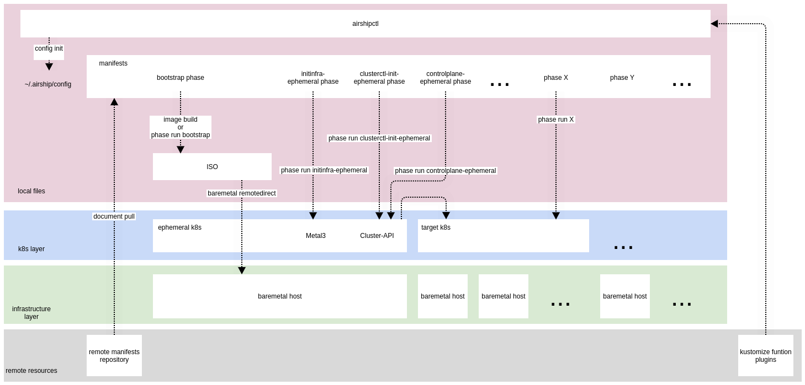

# airshipctl

## What is airshipctl

The `airshipctl` project is a CLI tool and go-lang library for declaratively
managing infrastructure and software.

The goal for the project is to provide a seamless experience to operators
wishing to leverage the best of breed opensource options such as the Cluster
API, Metal3-io, Kustomize, Kubeadm, and Argo -- into a straight forward and
easily approachable tool.

This project is the heart of the effort to produce Airship 2.0, which has three
main evolutions from
[1.0](https://airshipit.readthedocs.io/projects/airship-docs/en/latest/):

- Expand our use of Entrenched Upstream Projects.
- Embrace Kubernetes Custom Resource Definitions (CRD) – Everything becomes an
  Object in Kubernetes.
- Make the Airship Control Plane Ephemeral.

To learn more about the Airship 2.0 evolution, please check out the [Airship
Blog Series](https://www.airshipit.org/blog/).

## Contributing

This project is under heavy active development to reach an alpha state.

New developers should read the [contributing guide](CONTRIBUTING.md)   as
well as the [developer guide](docs/source/developers.md) in order to get started.

## Architecture

The `airshipctl` tool is designed to work against declarative infrastructure
housed in source control and manage the lifecycle of a site.

## Example Usage

In a nutshell, users of `airshipctl` should be able to do the following:

1. Create an `airshipctl` Airship Configuration for their site - sort of like a
   kubeconfig file.
1. Create a set of declarative documents representing the infrastructure
   (baremetal, cloud) and software.
1. Run `airshipctl document pull` to clone the document repositories in your
   Airship Configuration.
1. When deploying against baremetal infrastructure, run `airshipctl bootstrap
   isogen` to generate a self-contained ISO that can be used to boot the first
   host in the cluster into an ephemeral Kubernetes node.
1. When deploying against baremetal infrastructure, run `airshipctl bootstrap
   remotedirect` to remotely provision the first machine in the cluster using
   the generated ISO, providing an ephemeral Kubernetes instance that
   `airshipctl` can communicate with for subsequent steps. This ephemeral host
   provides a foothold in the target environment so we can follow the standard
   cluster-api bootstrap flow.
1. Run `airshipctl cluster initinfra --clustertype=ephemeral` to bootstrap the
   new ephemeral cluster with enough of the chosen cluster-api provider
   components to provision the target cluster.
1. Run `airshipctl clusterctl` to use the ephemeral Kubernetes host to provision
   at least one node of the target cluster using the cluster-api bootstrap flow.
1. Run `airshipctl cluster initinfra --clustertype=target` to bootstrap the new
   target cluster with any remaining infrastructure necessary to begin running
   more complex workflows such as Argo.
1. Run `airshipctl workflow submit sitemanage` to run the out of the box sitemanage
   workflow, which will leverage Argo to handle bootstrapping the remaining
   infrastructure as well as deploying and/or updating software.

As users evolve their sites declaration, whether adding additional
infrastructure, or software declarations, they can re-run `airshipctl workflow
submit sitemanage` to introduce those changes to the site.

## Project Resources

- Airship Website - [airshipit.org](https://airshipit.org)
- Airship UI Project - [opendev.org/airship/airshipui](https://opendev.org/airship/airshipui)
