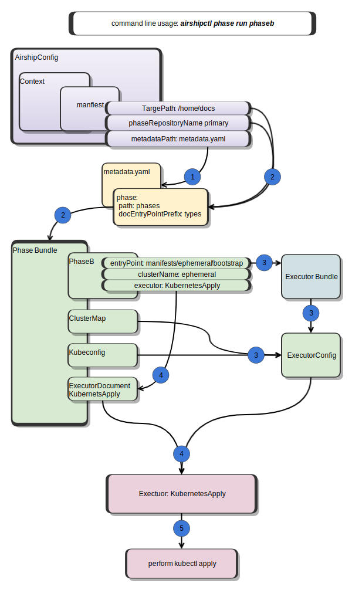

Phase execution engine
======================

General phase architecture
--------------------------

Airshipctl performs operations such as ``kubectl apply``,
``clusterctl init`` etc... using `phases <#phase>`__ defined in a `phase
bundle <#phase-bundle>`__. You can think of a phase as a step that has
to be performed in order to achieve a desired state of the managed site.

A phase is usually run against an `executor bundle <#executor-bundle>`__,
which is a document set containing kubernetes resources.

`Executor bundles <#executor-bundle>`__ and `phase
bundles <#phase-bundle>`__ are separate bundles and it is important to
understand the difference between them:

- A `phase bundle <#phase-bundle>`__ can be thought of as an airshipctl configuration
  bundle, it defines what will be executed and against which `executor bundles
  <#executor-bundle>`__. **Important**: path to phase bundle is constructed
  using the airship config current manifest TargetPath, phaseRepositoryName directory
  and phase.path field taken from metadata file.
- An `executor bundle <#executor-bundle>`__ defines a document set that the `executor
  <#executor>`__ will run against, for example kubernetes manifests, that will
  be applied to the kubernetes cluster by the KubernetesApply executor. The path to an
  executor bundle is constructed using targetPath, phaseRepoDir,
  docEntryPointPrefix(optional), documentEntryPoint.

   architecture diagram

Steps performed during phase execution based on diagram above:

1. Load metadata file based on airshipctl config from manifest
2. Build `phase bundle <#phase-bundle>`__ (please see phase bundle section
   for the details on how the path to the phase bundle is constructed using manifest
   and metadata.yaml file)
3. Prepare executor config
    - Find requested `phase <#phase>`__ in phase document bundle
    - Load `kubeconfig <#kubeconfig>`__ and `cluster map <#cluster-map>`__ from
      phase document bundle
    - Build `executor bundle <#executor-bundle>`__ based on phase document
4. Find `executor <#executor>`__ document in `phase Bundle <#phase-bundle>`__ and
   load executor providing config from step 3
5. Run `executor <#executor>`__, (validate/render available as well)

Phase
-----

Phase is a basic step that is executed by airshipctl to get a site to a
desired state. Phases are defined in `phase document
bundles <#phase-bundle>`__ as a `phase
document <https://godoc.org/opendev.org/airship/airshipctl/pkg/api/v1alpha1#Phase>`__
containing:

- `type meta <https://godoc.org/k8s.io/apimachinery/pkg/apis/meta/v1#TypeMeta>`__

    .. code:: yaml

        apiVersion: airshipit.org/v1alpha1
        kind: Phase

- `object meta <https://godoc.org/k8s.io/apimachinery/pkg/apis/meta/v1#ObjectMeta>`__

    **Note** that the clusterName that the phase belongs to comes from objects
    metadata and not from phase config. ClusterName is used to identify kubeconfig
    context and if needed cluster name of a parent cluster to be used during
    phase execution, also this clusterName must be present in the `cluster
    map <#cluster-map>`__.

    .. code:: yaml

        metadata:
          name: initinfra-ephemeral
          clusterName: ephemeral-cluster

- `config <https://godoc.org/opendev.org/airship/airshipctl/pkg/api/v1alpha1#PhaseConfig>`__

    Can include documentEntryPoint relative to **TargetPath** + **phaseRepoDir** +
    **docEntryPointPrefix**, some executors don't need a bundle, for example
    ``clusterctl move``, and in such cases documentEntryPoint field can be
    omitted. Also it includes an executorRef, which is a k8s
    `ObjectReference <https://godoc.org/k8s.io/kubernetes/pkg/apis/core#ObjectReference>`__,
    to an executor document, which defines an executor that will run
    the phase. The executor document referenced must exist in `phase bundle <#phase-bundle>`__

    .. code:: yaml

        config:
          executorRef:
            apiVersion: airshipit.org/v1alpha1
            kind: KubernetesApply
            name: kubernetes-apply
          documentEntryPoint: ephemeral/initinfra

Complete phase example:

.. code:: yaml

    apiVersion: airshipit.org/v1alpha1
    kind: Phase
    metadata:
      name: initinfra-ephemeral
      clusterName: ephemeral-cluster
    config:
      executorRef:
        apiVersion: airshipit.org/v1alpha1
        kind: KubernetesApply
        name: kubernetes-apply
      documentEntryPoint: ephemeral/initinfra

Phase Bundle
~~~~~~~~~~~~

A phase bundle controls how airshipctl will run, it contains but not limited to objects
depicted in the following table:

+-------------------------------------+---------------------------------------------+--------------------------------------------------------------------------------------------------------------------------------------+
| Name                                | Description                                 | API object source                                                                                                                    |
+=====================================+=============================================+======================================================================================================================================+
| `Cluster map <#cluster-map>`__      | Defines relationship between clusters       | `Cluster map API object source code <https://github.com/airshipit/airshipctl/blob/master/pkg/api/v1alpha1/cluster_map_types.go>`__   |
+-------------------------------------+---------------------------------------------+--------------------------------------------------------------------------------------------------------------------------------------+
| `Phase <#phase>`__                  | Basic step that is executed by airshipctl   | `phase document <https://github.com/airshipit/airshipctl/blob/master/pkg/api/v1alpha1/phase_types.go#L25-L36>`__                     |
+-------------------------------------+---------------------------------------------+--------------------------------------------------------------------------------------------------------------------------------------+
| `Kubeconfig <#kubeconfig>`__        | Credentials for kubernetes clusters         | `kubeconfig api object <https://github.com/airshipit/airshipctl/blob/master/pkg/api/v1alpha1/kubeconfig_types.go>`__                 |
+-------------------------------------+---------------------------------------------+--------------------------------------------------------------------------------------------------------------------------------------+
| `Phase plan <#phase-plan>`__        | Sequence of phase execution                 | `plan api object <https://github.com/airshipit/airshipctl/blob/master/pkg/api/v1alpha1/phase_types.go>`__                            |
+-------------------------------------+---------------------------------------------+--------------------------------------------------------------------------------------------------------------------------------------+
| `Executor document <#executor>`__   | Define what is going to be used by phases   | see `executor section <#executor>`__                                                                                                 |
+-------------------------------------+---------------------------------------------+--------------------------------------------------------------------------------------------------------------------------------------+

How is the path to a phase bundle constructed?
- A phase bundle is constructed
  using kustomize root that consists of TargetPath defined in current
  context manifest, and phase path taken from metadata file that is
  located inside the manifest: ``TargetPath + Metadata.Phase.Path``

Executor Bundle
~~~~~~~~~~~~~~~

- Executor bundle may contain any documents, they are available to
  executor during execution. For example these documents can be k8s
  resources, such as Deployments, Secrets, Services etc, and
  KubernetesApply executor will apply those resources to k8s cluster
  that phase belongs to.
- Some executors may require an executor bundle, some may not.
  ``Clusterctl move`` is an example of an executor that doesn't need a bundle
- Each executor may perform different actions based on the document set
- The path to the executor bundle is currently constructed using
  ``TargetPath + phaseRepositoryName + metadata.Phase.DocEntryPointPrefix
  + DocumentEntrypoint``

Executor
--------

Executor is what actually performs execution of the phase.
If a phase is considered as an abstract step of execution process,
then Executor is an implementation of this step. Executors are
defined as executor documents inside phase bundle, these documents
contain configuration for the executor, Kind and apiVersion that is
mapped by airshipctl internally to execution module that is invoked
during ``airshipctl phase`` commands.

Executor has access to kubeconfig, cluster map and its cluster name,
which allows the executor to find its context in kubeconfig, and if needed
parent cluster name and context as well.

Currently there is a limited, but growing number of executors:

-  `KubernetesApply <#kubernetesapply-executor-document-example>`__:
   applies resources to kubernetes.
-  `Clusterctl <#clusterctl-executor-document-example>`__: performs
   clusterctl commands based on its config.

**Note**: for more information about each executor please refer to the code
base, in the future more documentation will be developed for each
executor.

Clusterctl executor document example
~~~~~~~~~~~~~~~~~~~~~~~~~~~~~~~~~~~~

-  `Executor source
   code <https://godoc.org/opendev.org/airship/airshipctl/pkg/clusterctl/client#ClusterctlExecutor>`__
-  `Executor API object source
   code <https://godoc.org/opendev.org/airship/airshipctl/pkg/api/v1alpha1#Clusterctl>`__

.. code:: yaml

    apiVersion: airshipit.org/v1alpha1
    kind: Clusterctl
    metadata:
      labels:
        airshipit.org/deploy-k8s: "false"
      name: clusterctl_init
    init-options:
      core-provider: "cluster-api:v0.3.7"
      bootstrap-providers:
        - "kubeadm:v0.3.7"
      infrastructure-providers:
        - "metal3:v0.3.2"
      control-plane-providers:
        - "kubeadm:v0.3.7"
    action: init
    providers:
      - name: "metal3"
        type: "InfrastructureProvider"
        variable-substitution: true
        versions:
          v0.3.2: airshipctl/manifests/function/capm3/v0.3.2
      - name: "kubeadm"
        type: "BootstrapProvider"
        variable-substitution: true
        versions:
          v0.3.7: airshipctl/manifests/function/cabpk/v0.3.7
      - name: "cluster-api"
        type: "CoreProvider"
        variable-substitution: true
        versions:
          v0.3.7: airshipctl/manifests/function/capi/v0.3.7
      - name: "kubeadm"
        type: "ControlPlaneProvider"
        variable-substitution: true
        versions:
          v0.3.7: airshipctl/manifests/function/cacpk/v0.3.7
    additional-vars:
      CONTAINER_CAPM3_MANAGER: quay.io/metal3-io/cluster-api-provider-metal3:v0.3.2

KubernetesApply executor document example
~~~~~~~~~~~~~~~~~~~~~~~~~~~~~~~~~~~~~~~~~

-  `Executor source code
   <https://godoc.org/opendev.org/airship/airshipctl/pkg/k8s/applier#Executor>`__
-  `Executor API object source code
   <https://godoc.org/opendev.org/airship/airshipctl/pkg/api/v1alpha1#KubernetesApply>`__

.. code:: yaml

    apiVersion: airshipit.org/v1alpha1
    kind: KubernetesApply
    metadata:
      labels:
        airshipit.org/deploy-k8s: "false"
      name: kubernetes-apply
    config:
      waitOptions:
        timeout: 2000
      pruneOptions:
        prune: false

Kubeconfig
----------

Executors have access to site's kubeconfig. In kubeconfig, context names
must correspond to cluster names, for example if cluster name is
``workload01``, then kubeconfig should have context named ``workload01``
to be able to access this kubernetes cluster. (TODO: update
  this later when https://github.com/airshipit/airshipctl/issues/380 is closed)

Kubeconfig can come from various sources:

- `Phase bundle <#phase-bundle>`__, standard way of supplying kubeconfig
  is putting it into phase bundle as `kubeconfig api object
  <https://github.com/airshipit/airshipctl/blob/master/pkg/api/v1alpha1/kubeconfig_types.go>`__,
  `Kubeconfig api object example <#kubeconfig-api-object-example>`__.
  This is a good option when you are supplying predefined certificates
  for some of the clusters (ephemeral and target clusters) while still
  leaving possibility to use dynamic kubeconfig from a parent cluster
  for worker clusters.
- **User provided** , if a user wants to override kubeconfig, and use their own,
  they can do so using **--kubeconfig** flag in airshipctl, but they **MUST** be
  aware that kubeconfig context names must correspond to cluster names. (TODO: update
  this later when https://github.com/airshipit/airshipctl/issues/380 is closed)
- **Parent cluster** (*not implemented*), airshipctl uses clusterctl to deploy
  k8s clusters. And can use parent cluster to get kubeconfig secret from it, in
  such case dynamic kubeconfig should be allowed to be used in `cluster map
  <#cluster-map>`__, this is done by setting **dynamicKubeConf: true** in cluster
  map for specific cluster, default is false.

Kubeconfig api object example
~~~~~~~~~~~~~~~~~~~~~~~~~~~~~

.. code:: yaml

    apiVersion: airshipit.org/v1alpha1
    kind: KubeConfig
    metadata:
      name: default
      labels:
        airshipit.org/deploy-k8s: "false"
    config:
      apiVersion: v1
      clusters:
      - cluster:
          certificate-authority-data: <ca-data>
          server: https://10.23.25.102:6443
        name: target-cluster
      - cluster:
          certificate-authority-data: <ca-data>
          server: https://10.23.25.101:6443
        name: ephemeral-cluster
      contexts:
      - context:
          cluster: target-cluster
          user: target-cluster-admin
        name: target-cluster
      - context:
          cluster: ephemeral-cluster
          user: ephemeral-cluster-admin
        name: ephemeral-cluster
      current-context: ""
      kind: Config
      preferences: {}
      users:
      - name: ephemeral-cluster-admin
        user:
          client-certificate-data: <client-cert-data>
          client-key-data: <client-key-data>
      - name: target-cluster-admin
        user:
          client-certificate-data: <client-cert-data>
          client-key-data: <client-key-data>

Cluster Map
-----------

Cluster map defines parent-child relationship between clusters, allows
dynamic kubeconfig for clusters. When kubeconfig must be sourced from
a parent cluster, cluster map will be used to find parent cluster and
request kubeconfig from it.

Also, ClusterAPIRef is a part of Cluster Map and will be used to find
cluster object in kubernetes parent cluster. It also maps a clusterapi
name and namespaces for a given cluster. In the below example object,
the cluster api ref describes the reference to the cluster api object.
The cluster `workload01` in the cluster map has an clusterAPIRef to
corresponding cluster-api cluster object (kind: cluster) with name workload01
and inside namespace tenant01-namespace.

Cluster map is defined in `Phase bundle <#phase-bundle>`__ as a document.

- `Cluster map API object source code
  <https://godoc.org/opendev.org/airship/airshipctl/pkg/api/v1alpha1#ClusterMap>`__
- `Cluster map interface source code
  <https://godoc.org/opendev.org/airship/airshipctl/pkg/clusterctl/client#ClusterctlExecutor>`__

Example of cluster map
~~~~~~~~~~~~~~~~~~~~~~

.. code:: yaml

    apiVersion: airshipit.org/v1alpha1
    kind: ClusterMap
    metadata:
      labels:
        airshipit.org/deploy-k8s: "false"
      name: main-map
    map:
      target-cluster:
        parent: ephemeral-cluster
        # dynamicKubeConf: false # default value
      ephemeral-cluster: {}
      workload01:
        parent: target-cluster
        dynamicKubeConf: true
        clusterAPIRef:
          name: workload01
          namespace: tenant01-namespace

Metadata file
-------------

Phase plan
----------

TODO expand this part of documentation when we utilize phase plan
