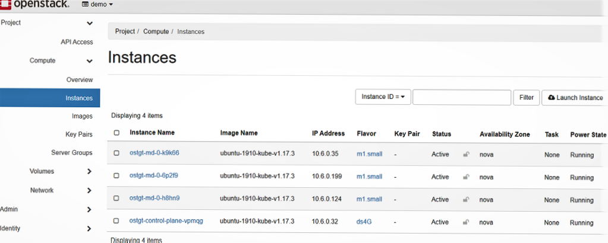

# Airshipctl integration with Cluster API Openstack

## Overview

This document provides instructions on the usage of airshipctl, to perform the
following operations with openstack as infrastructure provider:

- Initialize the management cluster with cluster api, and cluster api openstack
  provider components
- Create a target cluster with controlplane and worker machines on an openstack
  cloud environment

## Workflow

A simple workflow that deploys control plane and worker nodes involves the following operations:

- Initialize an ephemeral kubernetes cluster with cluster api and openstack provider
components:

*`$ airshipctl phase run clusterctl-init-ephemeral`*  or *`$ airshipctl phase run clusterctl-init-ephemeral --debug`*

- Create a target cluster with control plane node:

*`$ airshipctl phase run controlplane-ephemeral`*

- Deploy `calico` CNI as a `phase`

*`$ airshipctl phase run initinfra-target`*

- Initialize target cluster with `capi` and provider components

*`airshipctl phase run clusterctl-init-target`*

- Perform `move` to move `CRD`s to target cluster

*`airshipctl phase run clusterctl-move`*

- Deploy worker nodes in the target cluster

*`airshipctl phase run workers-target`*

## Common Prerequisite

- Install [Docker](https://www.docker.com/)
- Install and setup [kubectl](https://kubernetes.io/docs/tasks/tools/install-kubectl/)
- Install [Kind](https://kind.sigs.k8s.io/)
- Install [Kustomize](https://kubernetes-sigs.github.io/kustomize/installation/binaries/)
- Install [Airshipctl](https://docs.airshipit.org/airshipctl/developers.html)

## Openstack Prerequisites

### Credentials

In order to communicate with openstack cloud environment, following set of credentials are
needed to be generated.

The [env.rc](https://github.com/kubernetes-sigs/cluster-api-provider-openstack/blob/master/templates/env.rc) script
sets the required environment variables related to credentials.

`source env.rc <path/to/clouds.yaml> <cloud>`

The following variables are set.

```bash
OPENSTACK_CLOUD: The cloud name which is used as second argument in the command above
OPENSTACK_CLOUD_YAML_B64: The secret used by capo to access OpenStack cloud
OPENSTACK_CLOUD_PROVIDER_CONF_B64: The content of cloud.conf used by OpenStack cloud
OPENSTACK_CLOUD_CACERT_B64: (Optional) The content of custom CA file which can be specified in the clouds.yaml
```

### SSH key pair

An ssh key-pair must be specified by setting the `OPENSTACK_SSH_KEY_NAME` environment variable.

A key-pair can be created by executing the following command

`openstack keypair create [--public-key <file> | --private-key <file>] <name>`

### Availability zone

The availability zone must be set as an environment variable `OPENSTACK_FAILURE_DOMAIN`.

### DNS server

The DNS servers must be set as an environment variable `OPENSTACK_DNS_NAMESERVERS`.

### External network

The openstack environment should have an external network already present.
The external network id can be specified by setting the `spec.externalNetworkId` of `OpenStackCluster` CRD of the cluster template.
The public network id can be obtained by using command

```bash
openstack network list --external
```

### Floating IP

A floating IP is automatically created and associated with the load balancer or controller node, however floating IP can also be
specified explicitly by setting the `spec.apiServerLoadBalancerFloatingIP` of `OpenStackCluster` CRD.

Floating ip can be created using `openstack floating ip create <public network>` command.

Note: Only user with admin role can create a floating IP with specific IP address.

### Operating system image

A cluster api compatible image is required for creating target clusters. The kubeadm bootstrap provider that capo uses
depends on some pre-installed software like a container runtime, kubelet, kubeadm and also on an up-to-date version of cloud-init.

The image can be referenced by setting an environment variable `OPENSTACK_IMAGE_NAME`.

#### Install Packer

$ mkdir packer

$ cd packer

$ wget <https://releases.hashicorp.com/packer/1.6.0/packer_1.6.0_linux_amd64.zip>

$ unzip packer_1.6.0_linux_amd64.zip

$ sudo mv packer /usr/local/bin/

#### Install Ansible

$ sudo apt update

$ sudo apt upgrade

$ sudo apt install software-properties-common

$ sudo apt-add-repository ppa:ansible/ansible

$ sudo apt update

$ sudo apt install ansible

#### Build Cluster API Compliant VM Image

```bash
$ sudo -i
# apt install qemu-kvm libvirt-bin qemu-utils
$ sudo usermod -a -G kvm `<yourusername>`
$ sudo chown root:kvm /dev/kvm

```

Exit and log back in to make the change take place.

```bash
git clone <https://github.com/kubernetes-sigs/image-builder.git> image-builder
cd image-builder/images/capi/
vim packer/qemu/qemu-ubuntu-1804.json
```

Update the iso_url to `http://cdimage.ubuntu.com/releases/18.04/release/ubuntu-18.04.6-server-amd64.iso`

Make sure to use the correct checksum value from
[ubuntu-releases](http://cdimage.ubuntu.com/releases/18.04.5/release/SHA256SUMS)

$ make build-qemu-ubuntu-1804

#### Upload Images to Openstack

$ openstack image create --container-format bare --disk-format qcow2 --file  ubuntu-1804-kube-v1.16.14 ubuntu-1804-kube-v1.16.4

``` bash
$ openstack image list
+--------------------------------------+--------------------------+--------+
| ID                                   | Name                     | Status |
+--------------------------------------+--------------------------+--------+
| 10e31af1-5414-4bae-9500-922db677e695 | amphora-x64-haproxy      | active |
| 61bf8071-5e00-4806-83e0-612f8da03bf8 | cirros-0.5.1-x86_64-disk | active |
| 4fd894c7-9964-461b-bc9f-2e90fdade505 | ubuntu-1804-kube-v1.16.4 | active |
+--------------------------------------+--------------------------+--------+
```

## Getting Started

Kind is used to setup a kubernetes cluster, that will later be transformed
into an ephemeral management cluster using airshipctl. The kind kubernetes cluster will be
initialized with cluster API and Cluster API openstack(CAPO) provider components.

$ export KIND_EXPERIMENTAL_DOCKER_NETWORK=bridge

$ kind create cluster --name ephemeral-cluster --wait 200s

```bash
Creating cluster "ephemeral-cluster" ...
 ✓ Ensuring node image (kindest/node:v1.19.1) 🖼
 ✓ Preparing nodes 📦
 ✓ Writing configuration 📜
 ✓ Starting control-plane 🕹️
 ✓ Installing CNI 🔌
 ✓ Installing StorageClass 💾
 ✓ Waiting ≤ 3m20s for control-plane = Ready ⏳
 • Ready after 33s 💚
Set kubectl context to "kind-ephemeral-cluster"
You can now use your cluster with:

kubectl cluster-info --context kind-ephemeral-cluster
```

Check if all the pods are up.
$ kubectl get pods -A

```bash
NAMESPACE            NAME                                                      READY   STATUS    RESTARTS   AGE
kube-system          coredns-f9fd979d6-mhl9w                                   1/1     Running   0          75s
kube-system          coredns-f9fd979d6-tlksp                                   1/1     Running   0          75s
kube-system          etcd-ephemeral-cluster-control-plane                      1/1     Running   0          87s
kube-system          kindnet-qjggj                                             1/1     Running   0          75s
kube-system          kube-apiserver-ephemeral-cluster-control-plane            1/1     Running   0          87s
kube-system          kube-controller-manager-ephemeral-cluster-control-plane   1/1     Running   0          86s
kube-system          kube-proxy-87d7t                                          1/1     Running   0          75s
kube-system          kube-scheduler-ephemeral-cluster-control-plane            1/1     Running   0          86s
local-path-storage   local-path-provisioner-78776bfc44-wwr8x                   1/1     Running   0          75s
```

## Create airshipctl configuration

$ mkdir ~/.airship

$ airshipctl config init

Run the below command to configure openstack manifest, and add it to airship config

$ airshipctl config set-manifest openstack_manifest --repo primary \
--phase --url <https://opendev.org/airship/airshipctl> --branch master \
--metadata-path "manifests/site/openstack-test-site/metadata.yaml" \
--target-path /tmp/airship/

$ airshipctl config set-context ephemeral-cluster --manifest openstack_manifest

$ airshipctl config use-context ephemeral-cluster

List all phases

$ airshipctl phase plan

```bash
airshipctl phase plan
GROUP    PHASE
group1
         clusterctl-init-ephemeral
         controlplane-ephemeral
         initinfra-ephemeral
         clusterctl-init-target
         clusterctl-move
         workers-target
```

## Initialize ephemeral cluster

Execute the following command to initialize the ephemeral kubernetes cluster with CAPI and CAPO components.

$ airshipctl phase run clusterctl-init-ephemeral --debug --kubeconfig ~/.airship/kubeconfig

Wait for all the pods to be up and in `Running` state.

$ kubectl get pods -A --kubeconfig ~/.airship/kubeconfig

```bash
capi-kubeadm-bootstrap-system       capi-kubeadm-bootstrap-controller-manager-5646d9589c-smxc7       2/2     Running   0          53s
capi-kubeadm-control-plane-system   capi-kubeadm-control-plane-controller-manager-759bf846fc-bwfb7   2/2     Running   0          52s
capi-system                         capi-controller-manager-5d6b4d6769-9vrhv                         2/2     Running   0          54s
capi-webhook-system                 capi-controller-manager-548d4869b4-tswrz                         2/2     Running   0          54s
capi-webhook-system                 capi-kubeadm-bootstrap-controller-manager-6949f44db8-95hs5       2/2     Running   0          53s
capi-webhook-system                 capi-kubeadm-control-plane-controller-manager-7b6c4bf48d-rptp4   2/2     Running   0          52s
capi-webhook-system                 capo-controller-manager-84b749bdb4-fps7w                         2/2     Running   0          51s
capo-system                         capo-controller-manager-d69f8cbcf-gjgq5                          2/2     Running   0          51s
cert-manager                        cert-manager-cainjector-fc6c787db-plxsb                          1/1     Running   0          70s
cert-manager                        cert-manager-d994d94d7-8pmqf                                     1/1     Running   0          70s
cert-manager                        cert-manager-webhook-845d9df8bf-9fb6l                            1/1     Running   0          70s
kube-system                         coredns-f9fd979d6-mhl9w                                          1/1     Running   0          4m8s
kube-system                         coredns-f9fd979d6-tlksp                                          1/1     Running   0          4m8s
kube-system                         etcd-ephemeral-cluster-control-plane                             1/1     Running   0          4m20s
kube-system                         kindnet-qjggj                                                    1/1     Running   0          4m8s
kube-system                         kube-apiserver-ephemeral-cluster-control-plane                   1/1     Running   0          4m20s
kube-system                         kube-controller-manager-ephemeral-cluster-control-plane          1/1     Running   0          4m19s
kube-system                         kube-proxy-87d7t                                                 1/1     Running   0          4m8s
kube-system                         kube-scheduler-ephemeral-cluster-control-plane                   1/1     Running   0          4m19s
local-path-storage                  local-path-provisioner-78776bfc44-wwr8x                          1/1     Running   0          4m8s
```

At this point, the ephemeral cluster is initialized with cluster api and cluster api openstack provider components.

## Deploy control plane node

$ airshipctl phase run controlplane-ephemeral --debug --kubeconfig ~/.airship/kubeconfig

```bash
[airshipctl] 2020/11/24 18:44:28 opendev.org/airship/airshipctl@/pkg/k8s/applier/executor.go:129: Getting kubeconfig context name from cluster map
[airshipctl] 2020/11/24 18:44:28 opendev.org/airship/airshipctl@/pkg/k8s/applier/executor.go:134: Getting kubeconfig file information from kubeconfig provider
[airshipctl] 2020/11/24 18:44:28 opendev.org/airship/airshipctl@/pkg/k8s/applier/executor.go:139: Filtering out documents that should not be applied to kubernetes from document bundle
[airshipctl] 2020/11/24 18:44:28 opendev.org/airship/airshipctl@/pkg/k8s/applier/executor.go:147: Using kubeconfig at '/home/stack/.airship/kubeconfig' and context 'ephemeral-cluster'
[airshipctl] 2020/11/24 18:44:28 opendev.org/airship/airshipctl@/pkg/k8s/applier/executor.go:118: WaitTimeout: 33m20s
[airshipctl] 2020/11/24 18:44:28 opendev.org/airship/airshipctl@/pkg/k8s/applier/applier.go:76: Getting infos for bundle, inventory id is controlplane-ephemeral
[airshipctl] 2020/11/24 18:44:28 opendev.org/airship/airshipctl@/pkg/k8s/applier/applier.go:106: Inventory Object config Map not found, auto generating Inventory object
[airshipctl] 2020/11/24 18:44:28 opendev.org/airship/airshipctl@/pkg/k8s/applier/applier.go:113: Injecting Inventory Object: {"apiVersion":"v1","kind":"ConfigMap","metadata":{"creationTimestamp":null,"labels":{"cli-utils.sigs.k8s.io/inventory-id":"controlplane-ephemeral"},"name":"airshipit-controlplane-ephemeral","namespace":"airshipit"}}{nsfx:false,beh:unspecified} into bundle
[airshipctl] 2020/11/24 18:44:28 opendev.org/airship/airshipctl@/pkg/k8s/applier/applier.go:119: Making sure that inventory object namespace airshipit exists
secret/target-cluster-cloud-config created
cluster.cluster.x-k8s.io/target-cluster created
kubeadmcontrolplane.controlplane.cluster.x-k8s.io/target-cluster-control-plane created
openstackcluster.infrastructure.cluster.x-k8s.io/target-cluster created
openstackmachinetemplate.infrastructure.cluster.x-k8s.io/target-cluster-control-plane created
5 resource(s) applied. 5 created, 0 unchanged, 0 configured
secret/target-cluster-cloud-config is NotFound: Resource not found
cluster.cluster.x-k8s.io/target-cluster is NotFound: Resource not found
kubeadmcontrolplane.controlplane.cluster.x-k8s.io/target-cluster-control-plane is NotFound: Resource not found
openstackcluster.infrastructure.cluster.x-k8s.io/target-cluster is NotFound: Resource not found
openstackmachinetemplate.infrastructure.cluster.x-k8s.io/target-cluster-control-plane is NotFound: Resource not found
secret/target-cluster-cloud-config is Current: Resource is always ready
cluster.cluster.x-k8s.io/target-cluster is InProgress:
kubeadmcontrolplane.controlplane.cluster.x-k8s.io/target-cluster-control-plane is Current: Resource is current
openstackcluster.infrastructure.cluster.x-k8s.io/target-cluster is Current: Resource is current
openstackmachinetemplate.infrastructure.cluster.x-k8s.io/target-cluster-control-plane is Current: Resource is current
cluster.cluster.x-k8s.io/target-cluster is InProgress:
openstackcluster.infrastructure.cluster.x-k8s.io/target-cluster is Current: Resource is current
cluster.cluster.x-k8s.io/target-cluster is InProgress: Scaling up to 1 replicas (actual 0)
kubeadmcontrolplane.controlplane.cluster.x-k8s.io/target-cluster-control-plane is InProgress: Scaling up to 1 replicas (actual 0)
cluster.cluster.x-k8s.io/target-cluster is InProgress:
kubeadmcontrolplane.controlplane.cluster.x-k8s.io/target-cluster-control-plane is InProgress:
cluster.cluster.x-k8s.io/target-cluster is Current: Resource is Ready
kubeadmcontrolplane.controlplane.cluster.x-k8s.io/target-cluster-control-plane is Current: Resource is Ready
all resources has reached the Current status
```

To check logs run the below command

$ kubectl logs capo-controller-manager-d69f8cbcf-gjgq5 -n capo-system --all-containers=true -f --kubeconfig ~/.airship/kubeconfig

Wait for controlplane machine to be in `Running` state

$ kubectl get machines --kubeconfig ~/.airship/kubeconfig -w

```bash
NAME                                 PROVIDERID                                         PHASE
target-cluster-control-plane-flpfw   openstack://f423aa49-5e1f-4ee2-a9dc-bf2414889540   Provisioning
target-cluster-control-plane-flpfw   openstack://f423aa49-5e1f-4ee2-a9dc-bf2414889540   Running
```

Get kubeconfig of target-cluster

$ kubectl --namespace=default get secret/target-cluster-kubeconfig -o jsonpath={.data.value} | base64 --decode > ./target-cluster.kubeconfig

Check control plane node status, it should be in `NotReady` status.

$ kubectl get nodes --kubeconfig target-cluster.kubeconfig

```bash
NAME                                 STATUS     ROLES    AGE     VERSION
target-cluster-control-plane-n65lv   NotReady   master   5m45s   v1.17.3
```

## Deploy Calico CNI

Create `target-cluster` context

$ kubectl config set-context target-cluster --user target-cluster-admin --cluster target-cluster --kubeconfig target-cluster.kubeconfig

```bash
Context "target-cluster" created.
```

Check pods in target cluster

$ kubectl get po -A --kubeconfig target-cluster.kubeconfig

```bash
NAMESPACE     NAME                                                         READY   STATUS    RESTARTS   AGE
kube-system   coredns-6955765f44-ntvgb                                     0/1     Pending   0          9m20s
kube-system   coredns-6955765f44-xhr8d                                     0/1     Pending   0          9m20s
kube-system   etcd-target-cluster-control-plane-n65lv                      1/1     Running   0          9m35s
kube-system   kube-apiserver-target-cluster-control-plane-n65lv            1/1     Running   0          9m35s
kube-system   kube-controller-manager-target-cluster-control-plane-n65lv   1/1     Running   0          9m35s
kube-system   kube-proxy-zf8bg                                             1/1     Running   0          9m20s
kube-system   kube-scheduler-target-cluster-control-plane-n65lv            1/1     Running   0          9m35s
```

Deploy calico cni through phase `initinfra-target`

$ airshipctl phase run initinfra-target --kubeconfig target-cluster.kubeconfig

Check status of the control plane

$ kubectl get nodes --kubeconfig target-cluster.kubeconfig

```bash
NAME                                 STATUS   ROLES    AGE   VERSION
target-cluster-control-plane-n65lv   Ready    master   14m   v1.17.3
```

Check pods

$ kubectl get po -A --kubeconfig target-cluster.kubeconfig

```bash
NAMESPACE     NAME                                                         READY   STATUS    RESTARTS   AGE
kube-system   calico-kube-controllers-5bbd8f7588-zd279                     1/1     Running   0          3m10s
kube-system   calico-node-lxdt2                                            1/1     Running   0          3m10s
kube-system   coredns-6955765f44-ntvgb                                     1/1     Running   0          13m
kube-system   coredns-6955765f44-xhr8d                                     1/1     Running   0          13m
kube-system   etcd-target-cluster-control-plane-n65lv                      1/1     Running   0          14m
kube-system   kube-apiserver-target-cluster-control-plane-n65lv            1/1     Running   0          14m
kube-system   kube-controller-manager-target-cluster-control-plane-n65lv   1/1     Running   0          14m
kube-system   kube-proxy-zf8bg                                             1/1     Running   0          13m
kube-system   kube-scheduler-target-cluster-control-plane-n65lv            1/1     Running   0          14m
```

## Initialize the target cluster

Taint the controlplane node

$ kubectl taint node target-cluster-control-plane-n65lv node-role.kubernetes.io/master- --kubeconfig target-cluster.kubeconfig --request-timeout 10s

```bash
node/target-cluster-control-plane-n65lv untainted
```

Initialize the target cluster with `capi` and `capo` components

$ airshipctl phase run clusterctl-init-target --debug --kubeconfig target-cluster.kubeconfig

Check pods in the target cluster

$ $ kubectl get po -A --kubeconfig target-cluster.kubeconfig

```bash
NAMESPACE                           NAME                                                             READY   STATUS    RESTARTS   AGE
capi-kubeadm-bootstrap-system       capi-kubeadm-bootstrap-controller-manager-579cc6bd44-hmn5s       2/2     Running   0          29s
capi-kubeadm-control-plane-system   capi-kubeadm-control-plane-controller-manager-69c9bf9bc6-wjtn6   2/2     Running   0          23s
capi-system                         capi-controller-manager-565cc9dd6d-4kq8t                         2/2     Running   0          34s
capi-webhook-system                 capi-controller-manager-68b7cd6d79-jkpmp                         2/2     Running   0          37s
capi-webhook-system                 capi-kubeadm-bootstrap-controller-manager-699b84775f-9rxp9       2/2     Running   0          32s
capi-webhook-system                 capi-kubeadm-control-plane-controller-manager-b8b48d45f-jzpwv    2/2     Running   0          27s
capi-webhook-system                 capo-controller-manager-77dbfcfd49-5ndfw                         1/2     Running   0          21s
capo-system                         capo-controller-manager-cd88457c4-gzzq2                          1/2     Running   0          17s
cert-manager                        cert-manager-7ddc5b4db-6fgx8                                     1/1     Running   0          63s
cert-manager                        cert-manager-cainjector-6644dc4975-525q4                         1/1     Running   0          64s
cert-manager                        cert-manager-webhook-7b887475fb-82mb9                            1/1     Running   0          63s
kube-system                         calico-kube-controllers-5bbd8f7588-zd279                         1/1     Running   0          9m55s
kube-system                         calico-node-lxdt2                                                1/1     Running   0          9m55s
kube-system                         coredns-6955765f44-ntvgb                                         1/1     Running   0          20m
kube-system                         coredns-6955765f44-xhr8d                                         1/1     Running   0          20m
kube-system                         etcd-target-cluster-control-plane-n65lv                          1/1     Running   0          20m
kube-system                         kube-apiserver-target-cluster-control-plane-n65lv                1/1     Running   0          20m
kube-system                         kube-controller-manager-target-cluster-control-plane-n65lv       1/1     Running   0          20m
kube-system                         kube-proxy-zf8bg                                                 1/1     Running   0          20m
kube-system                         kube-scheduler-target-cluster-control-plane-n65lv                1/1     Running   0          20m
```

## Move `CRD`s from ephemeral to target cluster

$ KUBECONFIG=~/.airship/kubeconfig:target-cluster.kubeconfig kubectl config view --merge --flatten > ~/ephemeral_and_target.kubeconfig

$ airshipctl phase run clusterctl-move --debug --kubeconfig ~/ephemeral_and_target.kubeconfig

```bash
[airshipctl] 2020/11/24 19:14:04 opendev.org/airship/airshipctl@/pkg/clusterctl/client/executor.go:114: command 'clusterctl move' is going to be executed
[airshipctl] 2020/11/24 19:14:04 opendev.org/airship/airshipctl@/pkg/events/processor.go:61: Received event: {4 2020-11-24 19:14:04.210947904 +0000 UTC m=+0.491909426 {InitType {[]} {<nil>} {ApplyEventResourceUpdate ServersideApplied <nil>} {ResourceUpdateEvent <nil> <nil>} {PruneEventResourceUpdate Pruned <nil>} {DeleteEventResourceUpdate Deleted <nil>}} {<nil>} {ResourceUpdateEvent <nil> <nil>} {2 starting clusterctl move executor} {0 } {0 }}
Performing move...
Discovering Cluster API objects
Machine Count=1
ConfigMap Count=1
Cluster Count=1
KubeadmControlPlane Count=1
OpenStackCluster Count=1
OpenStackMachineTemplate Count=1
Secret Count=8
KubeadmConfig Count=1
OpenStackMachine Count=1
Total objects Count=16
Excluding secret from move (not linked with any Cluster) name="target-cluster-cloud-config"
Excluding secret from move (not linked with any Cluster) name="default-token-2tpdp"
Moving Cluster API objects Clusters=1
Pausing the source cluster
Set Cluster.Spec.Paused Paused=true Cluster="target-cluster" Namespace="default"
Creating target namespaces, if missing
Creating objects in the target cluster
Creating Cluster="target-cluster" Namespace="default"
Creating KubeadmControlPlane="target-cluster-control-plane" Namespace="default"
Creating ConfigMap="target-cluster-lock" Namespace="default"
Creating OpenStackCluster="target-cluster" Namespace="default"
Creating OpenStackMachineTemplate="target-cluster-control-plane" Namespace="default"
Creating Machine="target-cluster-control-plane-flpfw" Namespace="default"
Creating Secret="target-cluster-kubeconfig" Namespace="default"
Creating Secret="target-cluster-sa" Namespace="default"
Creating Secret="target-cluster-ca" Namespace="default"
Creating Secret="target-cluster-etcd" Namespace="default"
Creating Secret="target-cluster-proxy" Namespace="default"
Creating KubeadmConfig="target-cluster-control-plane-292z6" Namespace="default"
Creating OpenStackMachine="target-cluster-control-plane-n65lv" Namespace="default"
Creating Secret="target-cluster-control-plane-292z6" Namespace="default"
Deleting objects from the source cluster
Deleting Secret="target-cluster-control-plane-292z6" Namespace="default"
Deleting KubeadmConfig="target-cluster-control-plane-292z6" Namespace="default"
Deleting OpenStackMachine="target-cluster-control-plane-n65lv" Namespace="default"
Deleting Machine="target-cluster-control-plane-flpfw" Namespace="default"
Deleting Secret="target-cluster-kubeconfig" Namespace="default"
Deleting Secret="target-cluster-sa" Namespace="default"
Deleting Secret="target-cluster-ca" Namespace="default"
Deleting Secret="target-cluster-etcd" Namespace="default"
Deleting Secret="target-cluster-proxy" Namespace="default"
Deleting KubeadmControlPlane="target-cluster-control-plane" Namespace="default"
Deleting ConfigMap="target-cluster-lock" Namespace="default"
Deleting OpenStackCluster="target-cluster" Namespace="default"
Deleting OpenStackMachineTemplate="target-cluster-control-plane" Namespace="default"
Deleting Cluster="target-cluster" Namespace="default"
Resuming the target cluster
Set Cluster.Spec.Paused Paused=false Cluster="target-cluster" Namespace="default"
[airshipctl] 2020/11/24 19:14:08 opendev.org/airship/airshipctl@/pkg/events/processor.go:61: Received event: {4 2020-11-24 19:14:08.401089591 +0000 UTC m=+4.682051113 {InitType {[]} {<nil>} {ApplyEventResourceUpdate ServersideApplied <nil>} {ResourceUpdateEvent <nil> <nil>} {PruneEventResourceUpdate Pruned <nil>} {DeleteEventResourceUpdate Deleted <nil>}} {<nil>} {ResourceUpdateEvent <nil> <nil>} {3 clusterctl move completed successfully} {0 } {0 }}
```

## Deploy worker nodes

$ airshipctl phase run workers-target --debug --kubeconfig ~/target-cluster.kubeconfig

```bash
[airshipctl] 2020/11/24 19:17:18 opendev.org/airship/airshipctl@/pkg/k8s/applier/executor.go:129: Getting kubeconfig context name from cluster map
[airshipctl] 2020/11/24 19:17:18 opendev.org/airship/airshipctl@/pkg/k8s/applier/executor.go:134: Getting kubeconfig file information from kubeconfig provider
[airshipctl] 2020/11/24 19:17:18 opendev.org/airship/airshipctl@/pkg/k8s/applier/executor.go:139: Filtering out documents that shouldn't be applied to kubernetes from document bundle
[airshipctl] 2020/11/24 19:17:18 opendev.org/airship/airshipctl@/pkg/k8s/applier/executor.go:147: Using kubeconfig at '/home/stack/target-cluster.kubeconfig' and context 'target-cluster'
[airshipctl] 2020/11/24 19:17:18 opendev.org/airship/airshipctl@/pkg/k8s/applier/executor.go:118: WaitTimeout: 33m20s
[airshipctl] 2020/11/24 19:17:18 opendev.org/airship/airshipctl@/pkg/k8s/applier/applier.go:76: Getting infos for bundle, inventory id is workers-target
[airshipctl] 2020/11/24 19:17:18 opendev.org/airship/airshipctl@/pkg/k8s/applier/applier.go:106: Inventory Object config Map not found, auto generating Inventory object
[airshipctl] 2020/11/24 19:17:18 opendev.org/airship/airshipctl@/pkg/k8s/applier/applier.go:113: Injecting Inventory Object: {"apiVersion":"v1","kind":"ConfigMap","metadata":{"creationTimestamp":null,"labels":{"cli-utils.sigs.k8s.io/inventory-id":"workers-target"},"name":"airshipit-workers-target","namespace":"airshipit"}}{nsfx:false,beh:unspecified} into bundle
[airshipctl] 2020/11/24 19:17:18 opendev.org/airship/airshipctl@/pkg/k8s/applier/applier.go:119: Making sure that inventory object namespace airshipit exists
secret/target-cluster-cloud-config created
kubeadmconfigtemplate.bootstrap.cluster.x-k8s.io/target-cluster-md-0 created
machinedeployment.cluster.x-k8s.io/target-cluster-md-0 created
openstackmachinetemplate.infrastructure.cluster.x-k8s.io/target-cluster-md-0 created
4 resource(s) applied. 4 created, 0 unchanged, 0 configured
machinedeployment.cluster.x-k8s.io/target-cluster-md-0 is NotFound: Resource not found
openstackmachinetemplate.infrastructure.cluster.x-k8s.io/target-cluster-md-0 is NotFound: Resource not found
secret/target-cluster-cloud-config is Current: Resource is always ready
kubeadmconfigtemplate.bootstrap.cluster.x-k8s.io/target-cluster-md-0 is NotFound: Resource not found
kubeadmconfigtemplate.bootstrap.cluster.x-k8s.io/target-cluster-md-0 is Current: Resource is current
machinedeployment.cluster.x-k8s.io/target-cluster-md-0 is Current: Resource is current
openstackmachinetemplate.infrastructure.cluster.x-k8s.io/target-cluster-md-0 is Current: Resource is current
all resources has reached the Current status
```

Check the machines in the target cluster

$ kubectl get machines --kubeconfig target-cluster.kubeconfig

```bash
NAME                                   PROVIDERID                                         PHASE
target-cluster-control-plane-flpfw     openstack://f423aa49-5e1f-4ee2-a9dc-bf2414889540   Running
target-cluster-md-0-69958c66ff-98qgj   openstack://938ccec9-417d-40e9-b7fd-473d57c9f8bb   Running
target-cluster-md-0-69958c66ff-bjzqs   openstack://75bd8b0f-636a-4b6b-a791-e220a322f4a1   Running
target-cluster-md-0-69958c66ff-v59hl   openstack://00567578-b12d-4118-9c09-2c60011f2726   Running
```

Check component status of the target cluster

$ kubectl get cs --kubeconfig ~/ostgt.kubeconfig

```bash
NAME                 STATUS    MESSAGE             ERROR
controller-manager   Healthy   ok
scheduler            Healthy   ok
etcd-0               Healthy   {"health":"true"}
```

At this stage, the control plane and worker node are successfully created on openstack.



## Reference

### Installation Using Devstack

- Install [Devstack](https://docs.openstack.org/devstack/latest/guides/devstack-with-lbaas-v2.html)

- Create `ubuntu-1910-kube-v1.17.3.qcow2` image in the devstack.

Download a capi compatible image for ubuntu OS.

```bash
wget https://github.com/sbueringer/image-builder/releases/download/v1.17.3-04/ubuntu-1910-kube-v1.17.3.qcow2

openstack image create --container-format bare --disk-format qcow2 --file  ubuntu-1910-kube-v1.17.3.qcow2 ubuntu-1910-kube-v1.17.3
```

Check if the image status is `active`

```bash
stack@stackdev-ev:/opt/stack/devstack$ openstack image list
+--------------------------------------+--------------------------+--------+
| ID                                   | Name                     | Status |
+--------------------------------------+--------------------------+--------+
| 83002c1d-436d-4007-bea1-3ffc94fa193b | amphora-x64-haproxy      | active |
| a801c914-a0b9-485a-ba5f-246e912cb656 | cirros-0.5.1-x86_64-disk | active |
| 8e8fc7a8-cfe0-4251-bdde-8600838f2ed8 | ubuntu-1910-kube-v1.17.3 | active |
```

- Generate credentials

In devstack environment, normally the `clouds.yaml` file is found at `etc/openstack/` location.

Execute the following command to generate the cloud credentials for devstack

```bash
wget https://raw.githubusercontent.com/kubernetes-sigs/cluster-api-provider-openstack/master/templates/env.rc -O /tmp/env.rc
source /tmp/env.rc /etc/openstack/clouds.yaml devstack
```

A snippet of sample clouds.yaml file can be seen below for cloud `devstack`.

```bash
clouds:
  devstack:
    auth:
      auth_url: http://10.0.4.4/identity
      project_id: f3deb6e94bee4addaed3ba42d6ffaeba
      user_domain_name: Default
      username: demo
      password: pass
    region_name: RegionOne
```

The list of project_id-s can be retrieved by `openstack project list` in the devstack environment.

- Ensure that `demo` user has `admin` rights so that floating ip-s can be created at the time of
deploying the target cluster.

```bash
cd /opt/stack/devstack
export OS_USERNAME=admin
$ . ./openrc
$ openstack role add --project demo --user demo admin
```

- Create Floating IP

To create floating ip, following command can be used

`openstack floating ip create public --floating-ip-address $FLOATING_IP_ADDRESS`

where `FLOATING_IP_ADDRESS` is the specified ip address and `public` is the name of
the external network in devstack.

`openstack floating ip list` command shows the list of all floating ip-s.

- Allow ssh access to controlplane and worker nodes

Cluster api creates following security groups if `spec.managedSecurityGroups` of
`OpenStackCluster` CRD is set to true.

- k8s-cluster-default-`<CLUSTER-NAME>`-secgroup-controlplane (for control plane)
- k8s-cluster-default-`<CLUSTER-NAME>`-secgroup-worker (for worker nodes)

These security group rules include the kubeadm's
[Check required ports](https://kubernetes.io/docs/setup/production-environment/tools/kubeadm/install-kubeadm/#check-required-ports)
so that each node can not be logged in through ssh by default.

If ssh access to the nodes is required then follow the below steps -

Create a security group allowing ssh access

```bash
openstack security group create --project demo --project-domain Default allow-ssh
openstack security group rule create allow-ssh --protocol tcp --dst-port 22:22 --remote-ip 0.0.0.0/0
```

Add the security group to `OpenStackMachineTemplate` CRD as below

```bash
apiVersion: infrastructure.cluster.x-k8s.io/v1alpha3
kind: OpenStackMachineTemplate
metadata:
  name: ${CLUSTER_NAME}-control-plane
spec:
  template:
    spec:
      securityGroups:
      - name: allow-ssh
```

### Provider Manifests

Provider Configuration for Capo is referenced from
[Config](https://github.com/kubernetes-sigs/cluster-api-provider-openstack/tree/master/config)

$ tree airshipctl/manifests/function/capo

```bash
└── v0.3.1
    ├── certmanager
    │   ├── certificate.yaml
    │   ├── kustomization.yaml
    │   └── kustomizeconfig.yaml
    ├── crd
    │   ├── bases
    │   │   ├── infrastructure.cluster.x-k8s.io_openstackclusters.yaml
    │   │   ├── infrastructure.cluster.x-k8s.io_openstackmachines.yaml
    │   │   └── infrastructure.cluster.x-k8s.io_openstackmachinetemplates.yaml
    │   ├── kustomization.yaml
    │   ├── kustomizeconfig.yaml
    │   └── patches
    │       ├── cainjection_in_openstackclusters.yaml
    │       ├── cainjection_in_openstackmachines.yaml
    │       ├── cainjection_in_openstackmachinetemplates.yaml
    │       ├── webhook_in_openstackclusters.yaml
    │       ├── webhook_in_openstackmachines.yaml
    │       └── webhook_in_openstackmachinetemplates.yaml
    ├── default
    │   ├── kustomization.yaml
    │   ├── manager_role_aggregation_patch.yaml
    │   └── namespace.yaml
    ├── kustomization.yaml
    ├── manager
    │   ├── kustomization.yaml
    │   ├── manager.yaml
    │   ├── manager_auth_proxy_patch.yaml
    │   ├── manager_image_patch.yaml
    │   └── manager_pull_policy.yaml
    ├── patch_crd_webhook_namespace.yaml
    ├── rbac
    │   ├── auth_proxy_role.yaml
    │   ├── auth_proxy_role_binding.yaml
    │   ├── auth_proxy_service.yaml
    │   ├── kustomization.yaml
    │   ├── leader_election_role.yaml
    │   ├── leader_election_role_binding.yaml
    │   ├── role.yaml
    │   └── role_binding.yaml
    └── webhook
        ├── kustomization.yaml
        ├── kustomizeconfig.yaml
        ├── manager_webhook_patch.yaml
        ├── manifests.yaml
        ├── service.yaml
        └── webhookcainjection_patch.yaml
```

### CAPO test site with phases

```bash
airshipctl/manifests/site/openstack-test-site$ tree
.
├── ephemeral
│   └── controlplane
│       ├── cluster_clouds_yaml_patch.yaml
│       ├── control_plane_config_patch.yaml
│       ├── control_plane_ip.json
│       ├── control_plane_ip_patch.yaml
│       ├── control_plane_machine_count_patch.yaml
│       ├── control_plane_machine_flavor_patch.yaml
│       ├── dns_servers.json
│       ├── external_network_id.json
│       ├── kustomization.yaml
│       └── ssh_key_patch.yaml
├── metadata.yaml
├── phases
│   ├── infrastructure-providers.json
│   ├── kustomization.yaml
│   └── plan.yaml
└── target
    ├── initinfra
    │   └── kustomization.yaml
    └── workers
        ├── cluster_clouds_yaml_patch.yaml
        ├── kustomization.yaml
        ├── workers_cloud_conf_patch.yaml
        ├── workers_machine_count_patch.yaml
        ├── workers_machine_flavor_patch.yaml
        └── workers_ssh_key_patch.yaml

6 directories, 21 files
```

```bash
$ cat metadata.yaml
phase:
  path: manifests/site/openstack-test-site/phases
  docEntryPointPrefix: manifests/site/openstack-test-site
```

CAPO Phase plans

```bash
$ cat phases/plan.yaml
apiVersion: airshipit.org/v1alpha1
kind: PhasePlan
metadata:
  name: phasePlan
phases:
  - name: clusterctl-init-ephemeral
  - name: controlplane-ephemeral
  - name: initinfra-target
  - name: clusterctl-init-target
  - name: clusterctl-move
  - name: workers-target
```

### Cluster Templates

airshipctl/manifests/function/k8scontrol-capo contains cluster.yaml, controlplane.yaml templates.

```bash
cluster.yaml: Contains CRDs Cluster, OpenstackCluster, Secret
controlplane.yaml: Contains CRDs KubeadmControlPlane, OpenstackMachineTemplate
```

$ tree airshipctl/manifests/function/k8scontrol-capo

```bash
airshipctl/manifests/function/k8scontrol-capo
├── cluster.yaml
├── controlplane.yaml
└── kustomization.yaml
```

airshipctl/manifests/function/workers-capo contains workers.yaml

```bash
workers.yaml: Contains CRDs Cluster, OpenstackCluster, Secret
```

$ tree airshipctl/manifests/function/workers-capo

```bash
airshipctl/manifests/function/workers-capo
.
├── kustomization.yaml
└── workers.yaml
```

### Test Site Manifests

#### Patch Merge Strategy

Json and strategic merge patches are applied on templates in `manifests/function/k8scontrol-capo`
from `airshipctl/manifests/site/openstack-test-site/ephemeral/controlplane` when
`airshipctl phase run controlplane-ephemeral` command is executed

Json and strategic merge patches are applied on templates in `manifests/function/workers-capo`
from `airshipctl/manifests/site/openstack-test-site/target/workers` when
`airshipctl phase run workers-target` command is executed

```bash
controlplane/control_plane_ip.json: patches control plane ip in template function/k8scontrol-capo/cluster.yaml
controlplane/dns_servers.json: patches dns servers in template function/k8scontrol-capo/cluster.yaml
controlplane/external_network_id.json: patches external network id in template function/k8scontrol-capo/cluster.yaml
cluster_clouds_yaml_patch.yaml: patches clouds.yaml configuration in template function/k8scontrol-capo/cluster.yaml
controlplane/control_plane_ip_patch.yaml: patches controlplane ip in template function/k8scontrol-capo/controlplane.yaml
controlplane/control_plane_config_patch.yaml: patches cloud configuration in template function/k8scontrol-capo/controlplane.yaml
controlplane/ssh_key_patch.yaml: patches ssh key in template function/k8scontrol-capo/controlplane.yaml
controlplane/control_plane_machine_count_patch.yaml: patches controlplane replica count in template function/k8scontrol-capo/controlplane.yaml
controlplane/control_plane_machine_flavor_patch.yaml: patches controlplane machine flavor in template function/k8scontrol-capo/controlplane.yaml
workers/workers_cloud_conf_patch.yaml: patches cloud configuration in template function/workers-capo/workers.yaml
workers/workers_machine_count_patch.yaml: patches worker replica count in template function/workers-capo/workers.yaml
workers/workers_machine_flavor_patch.yaml: patches worker machine flavor in template function/workers-capo/workers.yaml
workers/workers_ssh_key_patch.yaml: patches ssh key in template function/workers-capo/workers.yaml

```

## Software Version Information

All the instructions provided in the document have been tested using the software and
version, provided in this section.

### Docker

```bash
$ docker version
Client: Docker Engine - Community
 Version:           19.03.12
 API version:       1.40
 Go version:        go1.13.10
 Git commit:        48a66213fe
 Built:             Mon Jun 22 15:45:36 2020
 OS/Arch:           linux/amd64
 Experimental:      false

Server: Docker Engine - Community
 Engine:
  Version:          19.03.12
  API version:      1.40 (minimum version 1.12)
  Go version:       go1.13.10
  Git commit:       48a66213fe
  Built:            Mon Jun 22 15:44:07 2020
  OS/Arch:          linux/amd64
  Experimental:     false
 containerd:
  Version:          1.2.13
  GitCommit:        7ad184331fa3e55e52b890ea95e65ba581ae3429
 runc:
  Version:          1.0.0-rc10
  GitCommit:        dc9208a3303feef5b3839f4323d9beb36df0a9dd
 docker-init:
  Version:          0.18.0
  GitCommit:        fec3683

```

### Kind

```bash
$ kind version
kind v0.8.1 go1.14.2 linux/amd64
```

### Kubectl

```bash
$ kubectl version --short
Client Version: v1.17.4
Server Version: v1.18.2
```

### Go

```bash
$ go version
go version go1.10.4 linux/amd64
```

### Kustomize

```bash
$ kustomize version
{Version:kustomize/v3.8.0 GitCommit:6a50372dd5686df22750b0c729adaf369fbf193c BuildDate:2020-07-05T14:08:42Z GoOs:linux GoArch:amd64}
```

### OS

The tests have been performed on Ubuntu 18.04 and Ubuntu 20.04 VMs.

```bash
$ cat /etc/os-release
NAME="Ubuntu"
VERSION="18.04.4 LTS (Bionic Beaver)"
ID=ubuntu
ID_LIKE=debian
PRETTY_NAME="Ubuntu 18.04.4 LTS"
VERSION_ID="18.04"
HOME_URL="https://www.ubuntu.com/"
SUPPORT_URL="https://help.ubuntu.com/"
BUG_REPORT_URL="https://bugs.launchpad.net/ubuntu/"
PRIVACY_POLICY_URL="https://www.ubuntu.com/legal/terms-and-policies/privacy-policy"
VERSION_CODENAME=bionic
UBUNTU_CODENAME=bionic
```

```bash
$ cat /etc/os-release
NAME="Ubuntu"
VERSION="20.04.1 LTS (Focal Fossa)"
ID=ubuntu
ID_LIKE=debian
PRETTY_NAME="Ubuntu 20.04.1 LTS"
VERSION_ID="20.04"
HOME_URL="https://www.ubuntu.com/"
SUPPORT_URL="https://help.ubuntu.com/"
BUG_REPORT_URL="https://bugs.launchpad.net/ubuntu/"
PRIVACY_POLICY_URL="https://www.ubuntu.com/legal/terms-and-policies/privacy-policy"
VERSION_CODENAME=focal
UBUNTU_CODENAME=focal
```

## Virtual Machine Specification

All the instructions in the document were performed on VM(with nested virtualization enabled)
with 16 vCPUs, 64 GB RAM.
